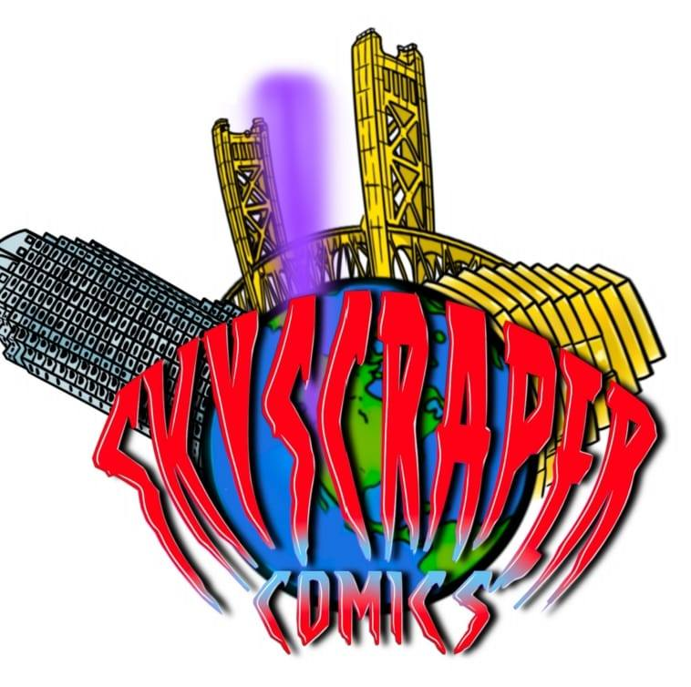
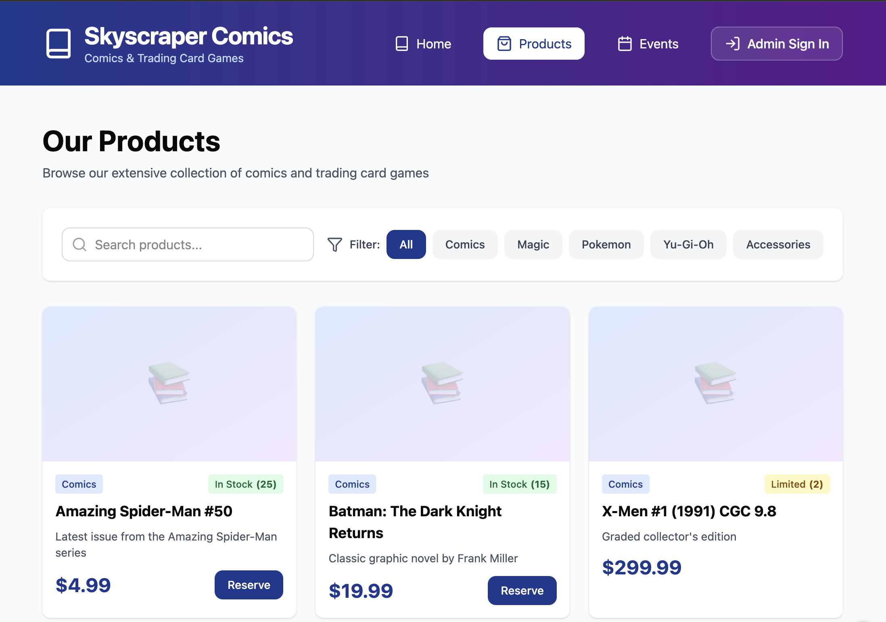
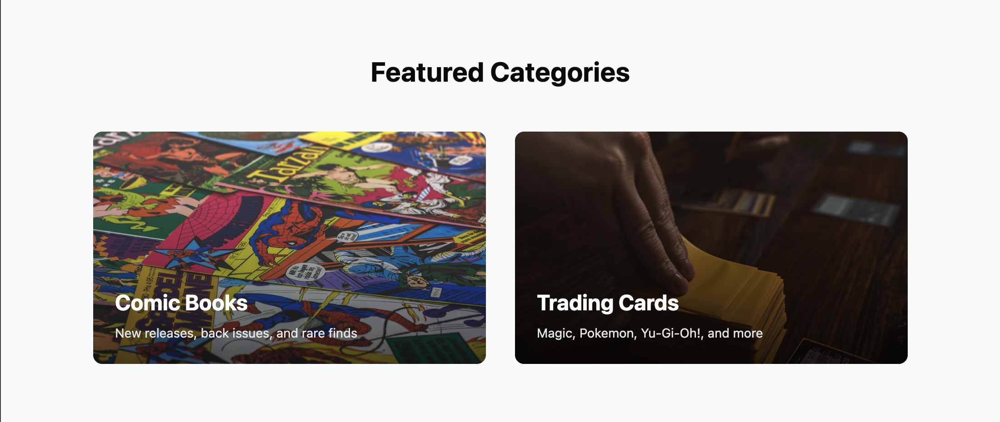
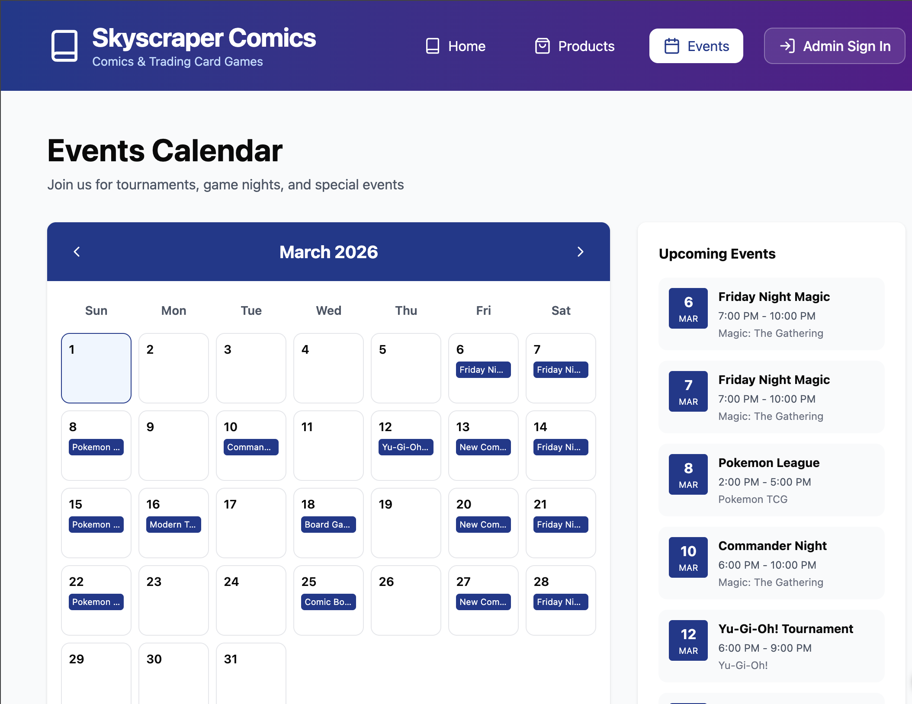
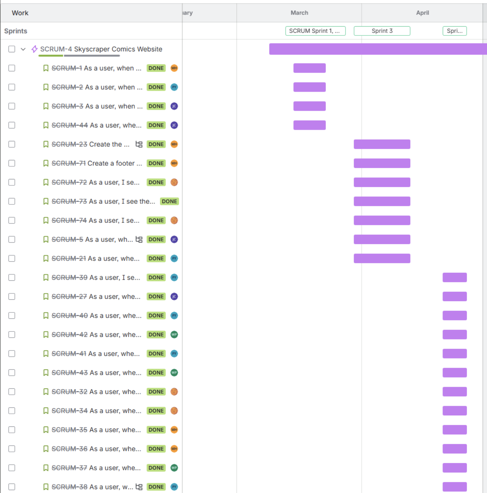
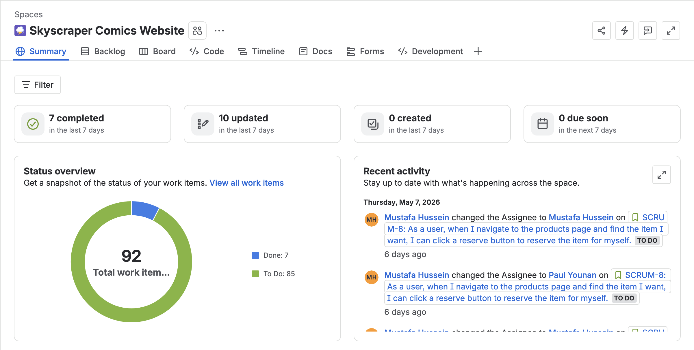
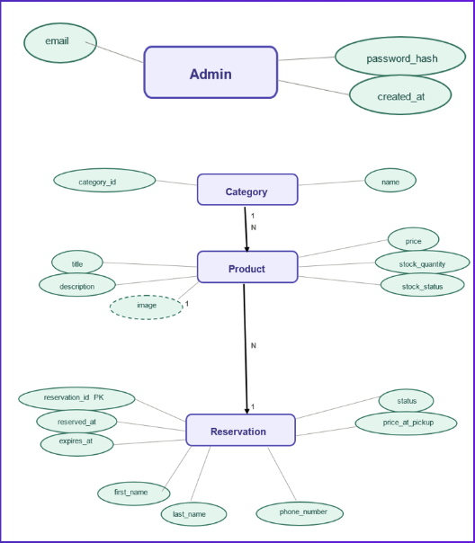

# 🏢 Skyscraper Comics

> **Your Desired Destination for Comic Books & Trading Card Products**

A modern, full-stack e-commerce platform dedicated to comic book enthusiasts and trading card game collectors. Skyscraper Comics combines sleek design with powerful functionality to deliver an exceptional shopping and reservation experience for collectors worldwide.


## 📖 Table of Contents

- [Project Overview](#project-overview)
- [Features](#features)
- [Tech Stack](#tech-stack)
- [Project Timeline](#project-timeline)
- [Visual Preview](#visual-preview)
- [Getting Started](#getting-started)
- [Developer Guide](#developer-guide)
- [Testing](#testing)
- [Deployment](#deployment)
- [Architecture](#architecture)
- [Contributing](#contributing)
- [License](#license)
- [Team](#team)

---

## 🎯 Project Overview

Skyscraper Comics is a senior capstone project (CSC 191) designed to create an intuitive, feature-rich platform for reserving and buying comic books and trading card products. The platform caters to both casual collectors and serious enthusiasts, providing a seamless browsing and purchasing experience.

### Mission

To empower comic book and trading card collectors by providing a centralized, user-friendly platform that celebrates the culture of collecting while delivering exceptional value and service.

### Key Focus Areas

- **User Experience**: Clean, responsive interface optimized for desktop and mobile
- **Product Discovery**: Advanced filtering, search, and recommendation systems
- **Admin Dashboard**: Comprehensive management tools for inventory and sales

---

## 🎨 Visual Preview

### Brand Identity


### Product & Style Imagery


### Prototype Screens






---

## ✨ Features

### 🛍️ User-Facing Features

- **Product Catalog**: Browse comics and trading cards with detailed product information
- **Advanced Search & Filtering**: Find products by title, series, condition, price, and more
- **Product Details**: High-resolution images, ratings, reviews, and inventory status
- **Shopping Cart**: Persistent cart with real-time updates
- **Reservation System**: Reserve products for pickup
- **Responsive Design**: Seamless experience across all devices

### 👨‍💼 Admin Features

- **Inventory Management**: Add, edit, and delete products
- **Dashboard Analytics**: Sales metrics, revenue trends, and inventory insights
- **Order Management**: Process and track customer orders
- **Category Management**: Organize products by type and series

### 🎨 Design Features

- **Responsive Layouts**: Mobile-first design approach
- **Accessibility**: WCAG compliant color contrast and navigation
- **Error Handling**: User-friendly error messages and recovery options

---

## 🛠️ Tech Stack

### Frontend
| Technology | Version | Purpose |
|------------|---------|---------|
| **Vue.js** | 3.x | Progressive JavaScript framework |
| **TypeScript** | Latest | Type safety and better DX |
| **Tailwind CSS** | 4.x | Utility-first CSS framework |
| **Vite** | Latest | Lightning-fast build tool |
| **Vue Router** | Latest | Client-side routing |
| **Pinia** | Latest | State management |
| **ApexCharts** | 4.4.0 | Chart visualization |
| **FullCalendar** | 6.1.x | Calendar functionality |

### Backend
*Later In CSC 191*

### DevOps & Tools
- **Node.js**: 18.x or later
- **npm/pnpm**: Package management
- **ESLint**: Code quality
- **Prettier**: Code formatting
- **Git**: Version control

---

## 📅 Project Timeline

> **Note**: Timeline milestones are tracked in JIRA. Update this section with key sprint goals and deliverables from your project management tool.

<div align="center">
  
  
</div>

### Phase 1: Foundation (Weeks 1-3)
- [ ] Project setup and architecture design
- [ ] Frontend scaffolding and component library
- [ ] Database schema design
- [ ] API specification

### Phase 2: Core Features (Weeks 4-7)
- [ ] Product catalog implementation
- [ ] Shopping cart functionality
- [ ] Reservation system
- [ ] Payment integration (placeholder)

### Phase 3: Admin & Analytics (Weeks 8-10)
- [ ] Admin dashboard development
- [ ] Analytics and reporting
- [ ] Inventory management
- [ ] Order processing system

### Phase 4: Optimization & Launch (Weeks 11-12)
- [ ] Performance optimization
- [ ] Security audit
- [ ] User acceptance testing
- [ ] Production deployment

### Upcoming Milestones
- **Sprint 4**: Enhanced search and recommendation engine
- **Sprint 5**: Mobile app considerations
- **Sprint 6**: Community features (reviews, wishlists)

---

## 🚀 Getting Started

### Prerequisites

Ensure you have the following installed:
- **Node.js** 18.x or later (20.x recommended)
- **npm** 9.x or **pnpm** 8.x
- **Git**
- **Visual Studio Code** (recommended IDE)
- **Volar** extension for Vue support

### Installation

1. **Clone the repository**
   ```bash
   git clone https://github.com/mustafahussein04/Skyscraper-Comics.git
   cd Skyscraper-Comics
   ```

2. **Navigate to the frontend directory**
   ```bash
   cd frontend
   ```

3. **Install dependencies**
   ```bash
   npm install
   # or
   pnpm install
   ```

4. **Set up environment variables**
   ```bash
   cp .env.example .env.local
   # Edit .env.local with your configuration
   ```

5. **Start the development server**
   ```bash
   npm run dev
   ```

   The application will be available at `http://localhost:5173`

---

## 👨‍💻 Developer Guide

### Project Structure

```
frontend/
├── src/
│   ├── components/          # Reusable Vue components
│   │   ├── layout/         # Layout wrappers
│   │   ├── products/       # Product-related components
│   │   ├── ecommerce/      # Shopping cart, checkout
│   │   ├── charts/         # Chart components
│   │   ├── forms/          # Form components
│   │   └── ui/             # UI utilities
│   ├── views/              # Page-level components
│   │   ├── Admin.vue       # Admin dashboard
│   │   ├── HomePage.vue    # Landing page
│   │   └── Products.vue    # Product listing
│   ├── router/             # Vue Router configuration
│   ├── types/              # TypeScript interfaces
│   ├── composables/        # Reusable logic
│   ├── mock-data/          # Sample data for development
│   ├── assets/             # Static assets
│   └── main.ts             # Entry point
├── public/                 # Static files
│   └── images/            # Product and UI images
├── vite.config.ts         # Vite configuration
├── tsconfig.json          # TypeScript configuration
└── tailwind.config.js     # Tailwind CSS configuration
```

### Available Scripts

```bash
# Development server
npm run dev

# Type checking
npm run type-check

# Build for production
npm run build

# Preview production build
npm run preview

# Lint with ESLint
npm run lint

# Format code with Prettier
npm run format
```

### Development Workflow

1. **Create a feature branch**
   ```bash
   git checkout -b feature/your-feature-name
   ```

2. **Make your changes** following the code style guide below

3. **Run linting and formatting**
   ```bash
   npm run lint
   npm run format
   ```

4. **Test your changes** (see Testing section)

5. **Commit with meaningful messages**
   ```bash
   git commit -m "feat: add product filter functionality"
   ```

6. **Push and create a Pull Request**

### Code Style Guide

- **Vue Components**: Use Composition API with `<script setup>` syntax
- **TypeScript**: Enable strict mode, define all types
- **Naming Conventions**:
  - Components: `PascalCase` (e.g., `ProductCard.vue`)
  - Functions/Variables: `camelCase` (e.g., `fetchProducts()`)
  - Constants: `UPPER_SNAKE_CASE` (e.g., `MAX_ITEMS_PER_PAGE`)
  - Composables: `useFeatureName` (e.g., `useSidebar`)

- **File Organization**:
  - Keep components small and focused
  - Extract shared logic into composables
  - Use meaningful folder structures

### Common Development Tasks

#### Adding a New Page
1. Create a `.vue` file in `src/views/`
2. Add route to `src/router/index.ts`
3. Link from navigation component

#### Creating a Reusable Component
1. Create file in `src/components/`
2. Follow component structure with TypeScript
3. Export from `src/components/index.ts` if applicable
4. Document props and events

#### Working with State (Pinia)
1. Create store in `src/stores/`
2. Define state, getters, and actions
3. Import in components using `useStore()`

---

## 🧪 Testing

> **Status**: To be implemented in CSC 191

### Testing Framework Strategy

- **Unit Tests**: Vitest for component and utility testing
- **E2E Tests**: Playwright for user workflow testing
- **Component Testing**: Vue Test Utils for component testing

### Running Tests

```bash
# Run all tests
npm run test

# Run tests in watch mode
npm run test:watch

# Generate coverage report
npm run test:coverage

# Run E2E tests
npm run test:e2e
```

### Testing Checklist

- [ ] Unit tests for business logic
- [ ] Component tests for Vue components
- [ ] Integration tests for workflows
- [ ] E2E tests for critical user paths
- [ ] Coverage target: 80%+ for core features
- [ ] Accessibility testing (axe-core)
- [ ] Performance testing

### Test Best Practices

1. Write tests alongside features
2. Test user behavior, not implementation
3. Keep tests focused and isolated
4. Use descriptive test names
5. Mock external dependencies

---

## 🌐 Deployment

> **Status**: To be completed in CSC 191

### Deployment Checklist

**Pre-Deployment**
- [ ] All tests passing
- [ ] Code review completed
- [ ] Type checking successful
- [ ] No linting errors
- [ ] Environment variables configured
- [ ] Database migrations run

**Deployment Steps**
```bash
# 1. Build the application
npm run build

# 2. Preview the build locally
npm run preview

# 3. Deploy to hosting platform
# (Specific commands depend on your hosting choice)
```

**Post-Deployment**
- [ ] Verify functionality in production
- [ ] Monitor error logs
- [ ] Check performance metrics
- [ ] Test critical user paths
- [ ] Monitor for 24 hours

### Hosting Options (To be decided)

- **Vercel**: Recommended for Vue.js (free tier available)
- **Netlify**: Alternative with generous free tier
- **AWS Amplify**: Enterprise-grade solution (more costly)
- **Docker + Custom Server**: Full control option

### Environment Variables

```env
# .env.local (development)
VITE_API_URL=http://localhost:3000
VITE_ENV=development

# .env.production
VITE_API_URL=https://api.skyscrapercomics.com
VITE_ENV=production
```

---

## 🏗️ Architecture

### Data Flow

1. **User Interaction** → Vue Component triggers action
2. **State Update** → Pinia store updates state
3. **API Call** → Composable fetches data from backend
4. **Response Handling** → State updates with response data
5. **Component Update** → Vue re-renders with new data

### Database Schema



*To be updated with the final schema in CSC 191*

## 🤝 Contributing

### How to Contribute

1. Fork the repository
2. Create a feature branch: `git checkout -b feature/your-feature`
3. Commit your changes: `git commit -m 'Add some feature'`
4. Push to the branch: `git push origin feature/your-feature`
5. Open a Pull Request

### Pull Request Guidelines

- Provide a clear title and description
- Link related JIRA tickets
- Ensure all tests pass
- Update documentation if needed
- Request review from team members

### Code Review Process

1. **Automated Checks**: GitHub Actions verify code quality
2. **Peer Review**: At least one team member reviews
3. **Testing Verification**: Reviewer confirms test coverage
4. **Merge**: PR merged after approval

---

### Documentation
- [Vue.js Documentation](https://vuejs.org/)
- [Tailwind CSS Documentation](https://tailwindcss.com/)
- [TypeScript Handbook](https://www.typescriptlang.org/docs/)
- [Vite Guide](https://vitejs.dev/)

---

### Design Resources
- [Figma Design File](./figma-design/)
- [Brand Guidelines](./assets/brand-guidelines.md) *(To be created)*
- [Component Library](./frontend/src/components/)

---

## 📊 Project Metrics

### Development Progress
- **Components**: 50+ Vue components
- **Pages**: 8+ page templates
- **Icons**: 100+ SVG icons included
- **Type Coverage**: 95%+

---

## 🐛 Bug Reports & Feature Requests

Found a bug? Have a feature idea? Please create an issue on GitHub:

1. Click the "Issues" tab
2. Click "New Issue"
3. Provide a clear title and description
4. Label appropriately (bug, enhancement, documentation)
5. Assign to relevant development member

---

## 📝 License

This project is licensed under the MIT License - see the [LICENSE](LICENSE) file for details.

---

## 👥 Team

**Skyscraper Comics Development Team**
- Everyone Participates In Each Level of Development
- Mustafa Hussein
- Paul Younan
- Josh Camarillo
- Benjamin Chisum
- Will Pham
- Ethan Jordan

### Course Information
- **Course**: CSC 191 - Senior Capstone Project
- **University**: California State University, Sacramento
- **Semester**: Spring 2026
- **Instructor**: Kenneth Elliot

---

## 📞 Contact & Support

- **Email**: skyscrapercomics1@gmail.com
- **GitHub Issues**: [Create an Issue](https://github.com/mustafahussein04/Skyscraper-Comics/issues)


**Last Updated**: May 14, 2026  
**Status**: Under Development

---